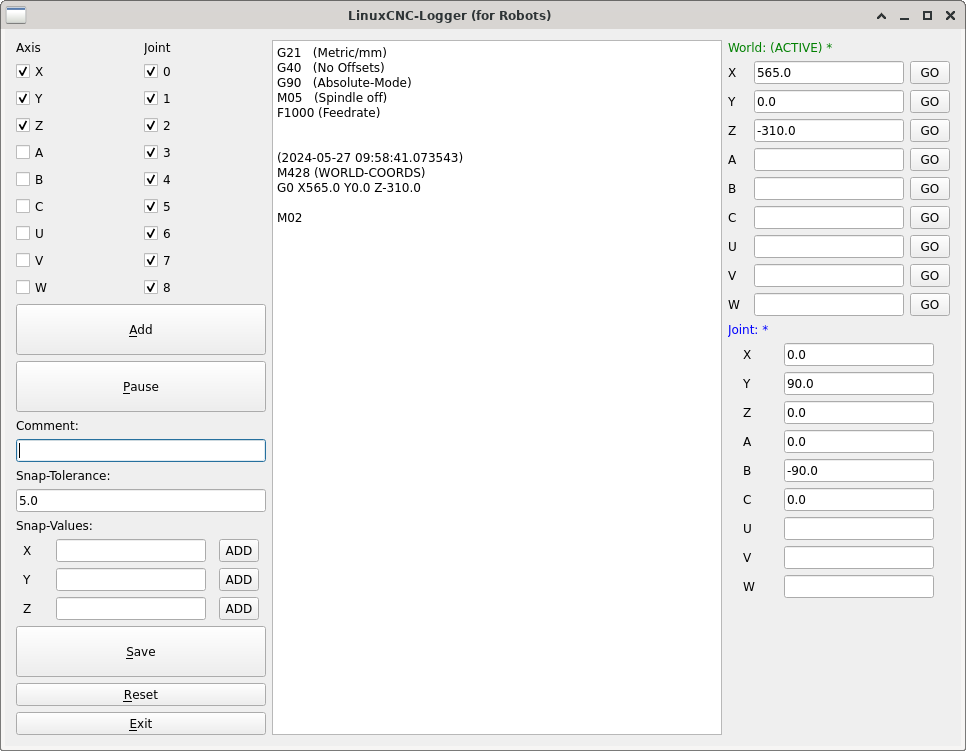
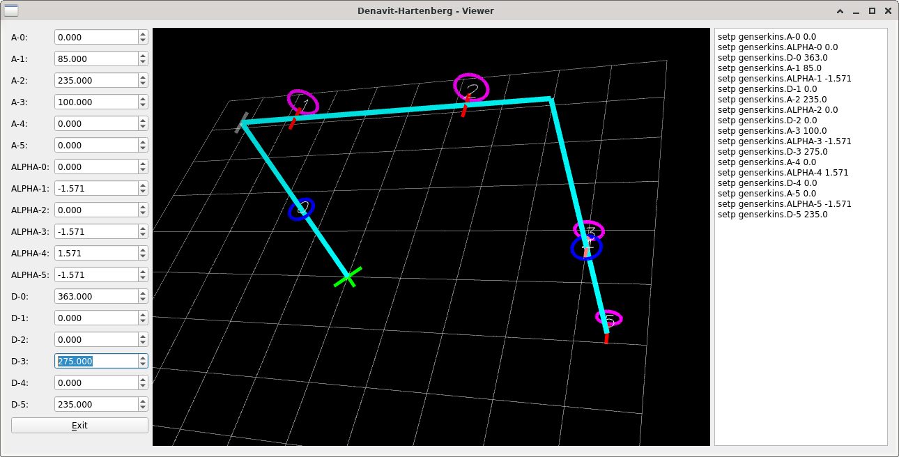

# linuxcnc-robot-logger

gcode logger especially for robots


this program is specially adapted to my needs.
I use a Parol6 with melfa configuration and RC servo gripper via analog output (M68).

this software can log world and joint possitions, as well as the gripper.


# quickstart
```
git clone https://github.com/multigcs/linuxcnc-robot-logger.git

cd linuxcnc-robot-logger
python3 linuxcnc-robot-logger.py /tmp/test.ngc
```

# screenshots



# recorded by this logger
[](https://www.youtube.com/shorts/Tp3savo-MGs "Position-Logger test (LinuxCNC-RIO + Parol6)")


# Denavit-Hartenberg (DH) parameters for genserkins
I have also added a small experimental tool to visualize the Denavit-Hartenberg parameter so that you can more easily adapt it to your own robots


